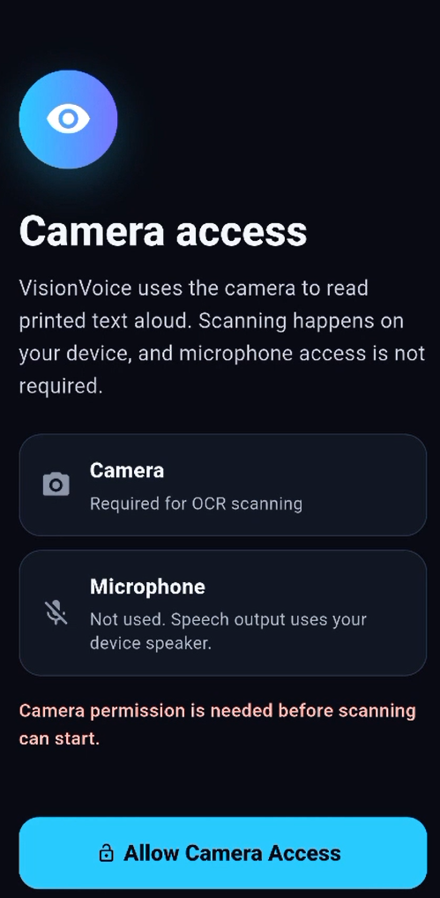
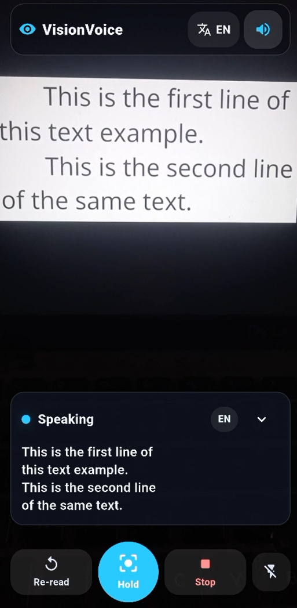
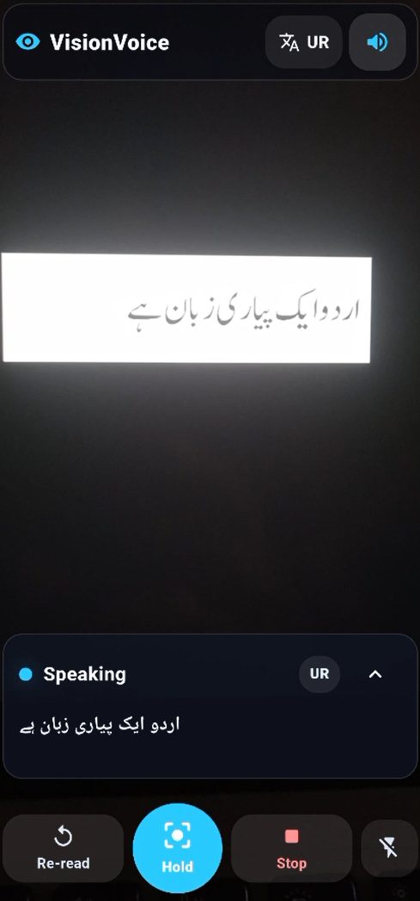
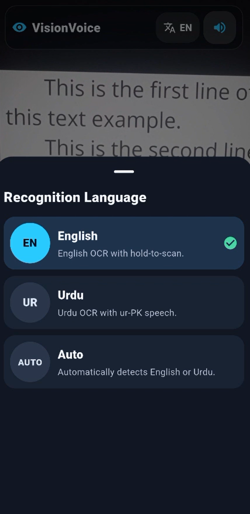

# VisionVoice OCR

**VisionVoice OCR** is a Flutter-based mobile application that scans printed English and Urdu text using OCR and reads the detected text aloud using text-to-speech. The app is designed to make text reading easier, faster, and more accessible, especially for users who prefer listening instead of reading.

The app supports **English OCR**, **Urdu OCR**, and an **Auto Mode** that detects whether the scanned text is English or Urdu and then speaks it using the correct voice.

---

## Overview

VisionVoice OCR combines camera-based scanning, optical character recognition, and text-to-speech into one simple mobile application. Users can point the camera at printed text, hold the scan button, and the app will detect and read the text aloud.

The project was developed using Flutter and Dart, with support from Google ML Kit for English text recognition and Google Vision OCR for Urdu text recognition.

---

## Features

* English text recognition
* Urdu text recognition
* Auto mode for detecting English or Urdu
* Text-to-speech output
* Hold-to-scan interaction
* Camera-based OCR scanning
* Flashlight support for better scanning
* Re-read detected text
* Stop speech option
* Clean and modern user interface
* Error handling for missing OCR results
* Urdu voice support using `ur-PK`
* English voice support using `en-US`

---

## App Modes

### English Mode

English mode captures an image using the camera, extracts English text using ML Kit text recognition, and reads the detected text aloud in English.

### Urdu Mode

Urdu mode captures an image and processes it through Google Vision OCR to recognize Urdu text. The detected Urdu text is then read aloud using an Urdu TTS voice.

### Auto Mode

Auto mode captures a single image and first checks for Urdu text. If Urdu text is found, it reads the text using Urdu speech. If Urdu text is not detected, it falls back to English OCR and reads the text in English.

---

## Tech Stack

* **Flutter**
* **Dart**
* **Google ML Kit Text Recognition**
* **Google Vision OCR**
* **Flutter TTS**
* **Camera Package**
* **Vibration / Haptic Feedback**

---

## How It Works

The app uses the device camera to capture an image of printed text. After capturing the image, the selected recognition mode determines which OCR process will be used.

```text
User selects language mode
        ↓
User holds the scan button
        ↓
Camera captures image
        ↓
OCR engine extracts text
        ↓
Detected text is displayed
        ↓
Text-to-speech reads the text aloud
```

For English, the app uses ML Kit Latin text recognition.
For Urdu, the app uses Google Vision OCR.
For Auto Mode, the app checks for Urdu first and then falls back to English if Urdu is not found.

---

## Project Structure

```text
VisionVoice-OCR/
│
├── android/                 # Android platform files
├── ios/                     # iOS platform files
├── lib/                     # Main Flutter source code
│   ├── models/              # Data models and enums
│   ├── screens/             # App screens
│   ├── services/            # OCR, camera, and TTS services
│   ├── widgets/             # Reusable UI components
│   └── main.dart            # App entry point
│
├── assets/                  # App assets
├── test/                    # Test files
├── pubspec.yaml             # Flutter dependencies
├── pubspec.lock             # Locked dependency versions
├── analysis_options.yaml    # Dart analysis rules
├── .gitignore               # Ignored files and folders
└── README.md                # Project documentation
```

---

## Main Functionalities

### OCR Scanning

The app supports scanning text through the camera. Unlike continuous live scanning, the app uses a hold-to-scan approach, giving users better control over when OCR should be performed.

### Text-to-Speech

After text is detected, the app automatically reads it aloud using the selected language voice. Users can also stop the speech or re-read the detected text.

### Auto Language Detection

Auto Mode improves usability by selecting the correct OCR and TTS flow based on the detected script. If the text contains Urdu characters, the app uses Urdu speech; otherwise, it uses English speech.

### Flashlight Support

The flashlight button helps users scan text in low-light environments.

---

## Packages Used

Some of the main packages used in this project include:

```yaml
camera
google_mlkit_text_recognition
flutter_tts
vibration
```

Additional dependencies are listed in the `pubspec.yaml` file.

---

## Setup Instructions

### Prerequisites

Before running the project, make sure you have the following installed:

* Flutter SDK
* Dart SDK
* Android Studio or VS Code
* Android device or emulator
* Git

Check Flutter installation:

```bash
flutter doctor
```

---

## Installation

Clone the repository:

```bash
git clone https://github.com/your-username/VisionVoice-OCR.git
```

Navigate to the project folder:

```bash
cd VisionVoice-OCR
```

Install dependencies:

```bash
flutter pub get
```

Run the app:

```bash
flutter run
```

---

## Google Vision API Key Setup

This project uses Google Vision OCR for Urdu text recognition. For security reasons, the API key is not ardcoded inside the source code.

Run the app with your Google Vision API key using:

```bash
flutter run --dart-define=GOOGLE_VISION_API_KEY=YOUR_API_KEY
```

Replace `YOUR_API_KEY` with your actual Google Vision API key.

Example:

```bash
flutter run --dart-define=GOOGLE_VISION_API_KEY=your_real_key_here
```


---

## Build APK

To build a release APK:

```bash
flutter build apk --release --dart-define=GOOGLE_VISION_API_KEY=YOUR_API_KEY
```

The APK will be generated inside:

```text
build/app/outputs/flutter-apk/
```

---

## Screenshots

### Loading Screen



### English Mode



### Urdu Mode



### Selection Screen



---

## Use Cases

VisionVoice OCR can be useful for:

* Reading printed English text aloud
* Reading printed Urdu text aloud
* Helping users who prefer audio-based reading
* Assisting visually impaired users
* Quickly extracting and listening to text from documents, books, signs, or notes
* Language accessibility support for English and Urdu readers

---

## Author

**Mustafa Naeem**

---

## Acknowledgement

This project was created as a practical Flutter OCR and text-to-speech application with English and Urdu support. It demonstrates the integration of camera scanning, OCR processing, language detection, and speech output in a mobile app.
